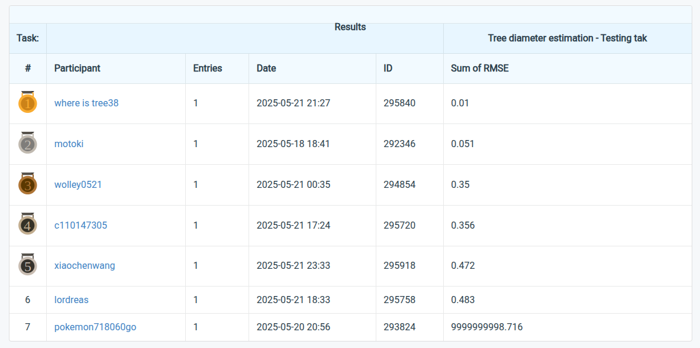

# dbh_estimation
Code for the Treescope tree diameter estimation challenge

This repository is developed for tree diameter estimation challenge on **Novel Approaches for Precision Agriculture and Forestry with Autonomous Robots** [workshop](https://ag-tech-icra2025.com/), [ICRA-2025](https://2025.ieee-icra.org/event/advances-in-social-robot-navigation-planning-hri-and-beyond/).

The competition's result has been shown in [codabench](https://www.codabench.org/competitions/7343/#/results-tab). The final result of our program ranks fifth among 28 participants, as shown in the following figure.
 

**Note:** We develop this program in one day, since limited time. Hence, there may have some bug need to be revised. And the code is not beautiful enough. If you test this program and find some issues, please do not hesitate to contact me: xchwang@whu.edu.cn

